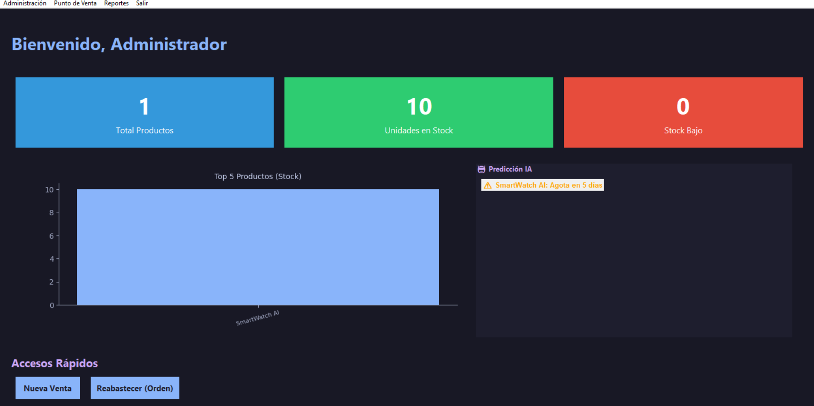

# Sistema de Ventas GUI App V2

> **Versión 2 de 2.** Refactor deliberado de [SistemaDeVentas--GUI-App](https://github.com/Geovanni-Gonzalez/SistemaDeVentas--GUI-App) (V1, persistencia en archivos planos) hacia SQLite con capa Repository, analítica y logging.

[](https://github.com/Geovanni-Gonzalez/SistemaDeVentas-GUI-App-V2/actions/workflows/ci.yml)

## Descripción
Segunda versión de sistema de ventas en Python con GUI, SQLite, analitica, reportes, sincronización/exportacion y módulos de comunicación.

## Objetivo
Evoluciónar un sistema de ventas desde archivos planos hacia base de datos y servicios complementarios.

## Tecnologías utilizadas
- Python 3
- Tkinter
- SQLite
- CSV
- Módulos de email/WhatsApp presentes en el código, pendientes de configuración documentada

## Funcionalidades principales
- Autenticación y menu
- CRUD y facturación
- SQLite
- Analitica/reportes
- Exportacion CSV

## Mi rol
Desarrollé la versión mejorada con base de datos, analitica, reportes y módulos auxiliares.

## Aprendizajes clave
- SQLite
- Sistemas desktop medianos
- Reporteria
- Servicios auxiliares

## Instalación y ejecución
```bash
cd SistemaDeVentas-GUI-App-V2/programa
python seed_data.py
python main.py
```

## Estructura del proyecto
- main.py: entrada
- src/database.py/repository.py: persistencia
- src/ui/: interfaz
- analytics.py/reports.py: reportes
- data/: base

## Capturas o demo


## Estado del proyecto
Proyecto académico funcional/en mejora.

## Valor técnico demostrado
Muestra evolución arquitectonica y persistencia relaciónal.

## Mejoras futuras
- Documentar email/WhatsApp
- Agregar migraciones
- Probar consultas

## Autor
Geovanni González  
Estudiante de Ingeniería en Computación  
GitHub: [Geovanni-Gonzalez](https://github.com/Geovanni-Gonzalez)


